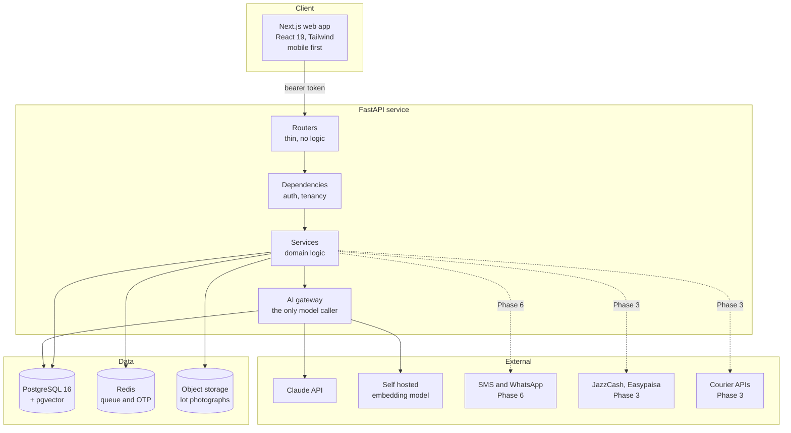
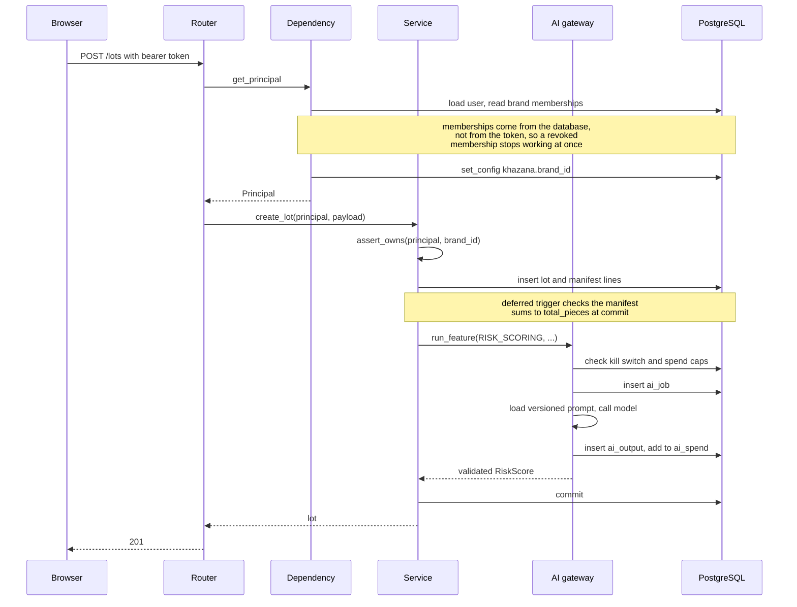

# Architecture

What exists after Phase 1, how the pieces fit, and the decisions that would be
expensive to reverse later.

## System shape



Dotted lines are integrations that exist as interfaces with sandbox
implementations, so no Phase 3 week is blocked waiting for a merchant account
or a courier contract, both of which need a registered company.

## Request lifecycle



## The four load bearing decisions

### 1. One gateway for every model call

Nothing outside `ai/gateway` constructs an Anthropic client. This buys five
things that scattered SDK calls never do: one place to change a model when a
price changes, cost attributed per feature and per brand, a kill switch per
feature, versioned prompts so a bad output can be traced to exact text, and a
single choke point for prompt injection defence.

The cost of the decision is one indirection. It is worth it.

### 2. Tenancy is explicit in the application, with the database as backstop

`core/tenancy.py` is the primary control: every query touching a brand owned
table goes through `scoped` or `assert_owns`. PostgreSQL row level security
policies exist in migration 0001 as a second line, but they only bite when the
application connects as a non owner role, and they do not exist at all on
SQLite where the tests run.

Relying on the policies alone would mean the protection is invisible in
development and untested, which is how it silently breaks.

A cross tenant read answers 404, never 403. Confirming that a record exists
but belongs to someone else is itself a leak.

### 3. Policy is data

Commission rates, discount bands, protection defaults, payout terms, lot
minimums, courier choice and per brand AI budgets are rows in
`brand_policies`. No module reads a commission constant.

This is what makes the build first order in the roadmap survivable: when a
brand negotiates different terms in Phase 6, it is an UPDATE, not a release.

One field resists configuration on purpose. `require_brand_approval` has a
CHECK constraint pinning it to true. A brand may set its own commercial terms
but may not remove its own protection.

### 4. The money path is boring

Integer rupees, never floats. Commission snapshotted onto the order. Totals
constrained by CHECK, not merely computed. Payouts require a named approver.
Escrow has an explicit `HELD` state that neither side can skip.

No model touches any of it.

## Layering, and what each layer may do

| Layer | May | May not |
| --- | --- | --- |
| Routers | Parse, call one service, map errors | Contain domain logic or raw queries |
| Dependencies | Authenticate, resolve tenancy, set session variables | Write data |
| Services | Domain logic, transactions, audit writes | Construct a model client, decide HTTP codes |
| AI gateway | Call models, price, cap, validate, record | Write business entities |
| Models | Structure, constraints, derived properties | Perform input or output |

A pull request that puts a query in a router or a commission constant in a
service is wrong even if the tests pass.

## Security posture after Phase 1

| Concern | Position today | Next step |
| --- | --- | --- |
| Authentication | Phone OTP, codes hashed and single use, attempts capped, requests rate limited | Add a second factor for admins |
| Sessions | HMAC signed access token, refresh token stored hashed and rotated on use | Move the refresh token to an httpOnly cookie in Phase 3 |
| Token storage in the browser | sessionStorage, which page scripts can read. Documented in `lib/session.ts` as a known limitation | Same cookie change |
| Tenant isolation | Application scoping plus tests, row level policies as backstop | Connect as a non owner role in production |
| Secrets | Environment only, `.env` git ignored, a detect private key pre commit hook | GitHub Secrets in CI, a vault later |
| Production misconfiguration | Startup refuses to boot with the sample secret, OTP echo on, AI offline, or SQLite | Keep extending the check |
| Prompt injection | Untrusted text is passed as data, tools are read mostly, no tool moves money or changes a role | Adversarial cases in every eval suite |
| AI cost | Caps checked before the call, per feature kill switches, every call priced and logged | Cost dashboard in Phase 4 |
| Audit | Append only approvals and audit log, enforced by trigger | Log viewer in the admin panel, Phase 3 |

## Deliberate limitations after Phase 1

Stated so they are decisions rather than surprises.

- **No marketplace yet.** No catalogue, search, cart, orders, payments or
  logistics endpoints. The schema and the gateway they will use are built and
  tested; the endpoints are Phase 3.
- **No AI features yet.** The gateway, routing, prompts, schemas, cost
  accounting and eval harness are built, with two real prompts. The features
  themselves are Phase 2.
- **Offline AI by default.** `AI_OFFLINE=true` means the eval suites and the
  tests read recorded fixtures. This pins the pipeline, not the model.
  Measuring the model is `python -m khazana.ai.evals.run --live`, which spends
  real money and is a deliberate act.
- **Visual search needs PostgreSQL.** The portable vector column degrades to
  JSON on SQLite, which stores and retrieves but cannot search.
- **No background worker process.** Redis is configured and the job table
  exists, but the queue consumer arrives with the first batch feature in
  Phase 2.
- **One language in the interface.** The locale machinery, the three
  dictionaries and the direction handling are built; only English is wired to
  the shell.

## Running tests

```bash
make test     # SQLite, fast, every test
make cov      # with coverage
make evals    # AI eval suites against fixtures, free
```

CI runs four jobs: the repository rules gate, API lint and types and tests,
migrations applied then rolled back then applied again on real PostgreSQL, and
the web lint and build. The eval job runs the suites offline so a prompt
change cannot silently break the pipeline and cannot cost money.
