# Database schema

Generated from the SQLAlchemy models by `scripts/generate-erd.py`. Do not edit
this file by hand: change the models in `apps/api/src/khazana/models/` and run
the script again, so the diagram cannot drift from the code.

PostgreSQL in every environment except the test suite, which runs on SQLite
for speed. The PostgreSQL only parts, meaning the deferred manifest trigger,
the append only triggers, the row level security policies and the pgvector
index, are created in migration 0001 and verified by the migration job in CI.

## Tables

| Table | Columns | Brand scoped | Purpose |
| --- | --- | --- | --- |
| `ai_jobs` | 15 | no | One row per unit of AI work, including blocked ones. |
| `ai_outputs` | 19 | no | What the model produced, what it cost, what the human changed. |
| `ai_spend` | 8 | no | Daily spend per feature and brand. Caps are enforced on it. |
| `audit_log` | 15 | no | Append only before and after snapshots of consequential actions. |
| `brand_excluded_cities` | 6 | yes | Default region lock per brand. |
| `brand_members` | 6 | yes | Links users to brands. How tenancy is resolved. |
| `brand_policies` | 15 | yes | Commission, discount band, protection defaults, AI budget. |
| `brands` | 16 | no | The selling brand. The tenant boundary. |
| `categories` | 8 | no | Two level taxonomy. The fixed list the AI must map into. |
| `disputes` | 14 | yes | A buyer says the goods do not match the manifest. |
| `embeddings` | 10 | no | Vectors for visual and semantic search. |
| `listing_approvals` | 11 | yes | Append only record of every approval decision. |
| `lot_defects` | 8 | yes | Itemised defects, required for grade C. |
| `lot_excluded_cities` | 6 | yes | Per lot region lock, overriding the brand default. |
| `lot_photos` | 12 | yes | Photographs, and the input to the AI listing feature. |
| `lots` | 26 | yes | A quantity of one product sold as a single unit. |
| `manifest_lines` | 8 | yes | Size and colour breakdown. Must sum to total pieces. |
| `order_lines` | 9 | yes | What was actually bought, by size and colour. |
| `orders` | 24 | yes | One purchase of one lot, whole or part. |
| `otp_challenges` | 10 | no | Pending phone verifications, code stored hashed. |
| `payments` | 14 | no | Money in, and the escrow state machine. |
| `payouts` | 12 | yes | Money out to a brand, one per order. |
| `reseller_profiles` | 14 | no | Buyer side business profile and verification. |
| `sessions` | 9 | no | Refresh tokens, stored hashed. |
| `shipments` | 14 | yes | Courier consignments. |
| `users` | 13 | no | One row per phone number. The identity anchor. |
| `verification_documents` | 14 | yes | NTN, incorporation certificate, CNIC, with a review trail. |

## Design decisions worth knowing

**Tenancy is denormalised on purpose.** Every brand owned table carries a
`brand_id`, even where it could be reached through a join. One WHERE clause
isolates a tenant, the row level policies need no recursive joins, and the
isolation tests are cheap to write. A multi tenant leak is the one bug that
would end this business, so the schema pays a small normalisation price to
make it hard.

**The manifest rule is enforced three times.** The sum of `manifest_lines`
must equal `lots.total_pieces` once a lot leaves draft. It is checked in the
service layer so the brand gets a clear message, by a deferred constraint
trigger so a background job or a direct SQL fix cannot break it, and by a test
so neither of those can be removed quietly.

**A lot cannot be live without approval.** A CHECK constraint requires
`approved_at` to be set before the status can be live. The brand protection
promise is a database constraint, not a convention.

**Order arithmetic is constrained.** The subtotal, the total and the brand
payout each have a CHECK constraint tying them to the other columns, so no
code path can persist an order whose totals do not add up.

**Commission is snapshotted onto the order.** Reading it live from the brand
policy would mean that changing a rate silently rewrites the history of what
was owed on past orders.

**Money is integer rupees.** Never a float. Paisa are not used, because this
market prices these goods in whole rupees.

**Two tables are append only.** Listing approvals and the audit log have
triggers that reject UPDATE and DELETE. An audit trail that can be edited
proves nothing.

**AI outputs store the correction as well as the draft.** The pair is the
quality metric now and the training corpus later, and it costs nothing to
collect if the column exists from the start instead of being added in year two
when the data is already lost.

## Entity relationship diagram

```mermaid
erDiagram
    ai_jobs {
        string feature "required"
        string status "required"
        string mode "required"
        string entity_type
        string entity_id
        string brand_id "FK"
        string requested_by_user_id "FK"
        string blocked_reason
        datetime started_at
        datetime finished_at
        int attempts "required"
        text error
        string id "PK"
        datetime created_at "required"
        datetime updated_at "required"
    }
    ai_outputs {
        string job_id "FK, required"
        string model "required"
        string prompt_name "required"
        int prompt_version "required"
        string effort
        int input_tokens "required"
        int output_tokens "required"
        int cache_read_tokens "required"
        int cache_write_tokens "required"
        decimal cost_usd "required"
        int latency_ms
        json output
        bool accepted
        json human_corrected
        string reviewed_by_user_id "FK"
        datetime reviewed_at
        string id "PK"
        datetime created_at "required"
        datetime updated_at "required"
    }
    ai_spend {
        date day "required"
        string feature "required"
        string brand_id "FK"
        int calls "required"
        decimal cost_usd "required"
        string id "PK"
        datetime created_at "required"
        datetime updated_at "required"
    }
    audit_log {
        string actor_user_id "FK"
        string actor_role
        string actor_kind "required"
        string action "required"
        string entity_type "required"
        string entity_id
        string brand_id "FK"
        json before
        json after
        text note
        string ip
        string user_agent
        string id "PK"
        datetime created_at "required"
        datetime updated_at "required"
    }
    brand_excluded_cities {
        string brand_id "FK, required"
        string city "required"
        string reason
        string id "PK"
        datetime created_at "required"
        datetime updated_at "required"
    }
    brand_members {
        string brand_id "FK, required"
        string user_id "FK, required"
        string role_in_brand "required"
        string id "PK"
        datetime created_at "required"
        datetime updated_at "required"
    }
    brand_policies {
        string brand_id "FK, required"
        decimal commission_percent "required"
        int payout_terms_days "required"
        int min_lot_value_pkr "required"
        decimal min_discount_percent "required"
        decimal max_discount_percent "required"
        string default_visibility "required"
        bool require_brand_approval "required"
        bool allow_cod "required"
        bool allow_part_lot_orders "required"
        bool auto_apply_ai_draft "required"
        decimal ai_monthly_budget_usd "required"
        string id "PK"
        datetime created_at "required"
        datetime updated_at "required"
    }
    brands {
        string name "required"
        string legal_name
        string slug "required"
        string ntn
        string city "required"
        string status "required"
        string unbranded_label
        string contact_phone
        string contact_email
        string reviewed_by_user_id "FK"
        datetime reviewed_at
        string review_note
        string id "PK"
        datetime created_at "required"
        datetime updated_at "required"
        datetime deleted_at
    }
    categories {
        string parent_id "FK"
        string name "required"
        string slug "required"
        bool requires_expiry "required"
        int sort_order "required"
        string id "PK"
        datetime created_at "required"
        datetime updated_at "required"
    }
    disputes {
        string order_id "FK, required"
        string brand_id "FK, required"
        string raised_by_user_id "FK, required"
        string reason "required"
        text detail
        json evidence_keys
        string status "required"
        text resolution
        int refund_pkr
        string resolved_by_user_id "FK"
        datetime resolved_at
        string id "PK"
        datetime created_at "required"
        datetime updated_at "required"
    }
    embeddings {
        string owner_type "required"
        string owner_id "required"
        string brand_id "FK"
        string lot_id "FK"
        string model "required"
        int dim "required"
        json vector "required"
        string id "PK"
        datetime created_at "required"
        datetime updated_at "required"
    }
    listing_approvals {
        string lot_id "FK, required"
        string brand_id "FK, required"
        string action "required"
        string actor_user_id "FK"
        string actor_role "required"
        string visibility_at_action "required"
        string note
        json snapshot
        string id "PK"
        datetime created_at "required"
        datetime updated_at "required"
    }
    lot_defects {
        string lot_id "FK, required"
        string brand_id "FK, required"
        string issue "required"
        int pieces_affected "required"
        string photo_id "FK"
        string id "PK"
        datetime created_at "required"
        datetime updated_at "required"
    }
    lot_excluded_cities {
        string lot_id "FK, required"
        string brand_id "FK, required"
        string city "required"
        string id "PK"
        datetime created_at "required"
        datetime updated_at "required"
    }
    lot_photos {
        string lot_id "FK, required"
        string brand_id "FK, required"
        string file_key "required"
        string kind "required"
        int sort_order "required"
        int width
        int height
        int bytes_stored
        bool is_optimised "required"
        string id "PK"
        datetime created_at "required"
        datetime updated_at "required"
    }
    lots {
        string lot_code "required"
        string brand_id "FK, required"
        string category_id "FK, required"
        string title "required"
        text description
        string season
        string condition_grade "required"
        int total_pieces "required"
        int retail_price_per_piece_pkr "required"
        int lot_price_pkr "required"
        int min_order_pieces "required"
        string stock_city "required"
        decimal weight_kg
        int cartons
        date expiry_date
        date available_until
        string status "required"
        string visibility "required"
        datetime approved_at
        string approved_by_user_id "FK"
        string created_by_user_id "FK"
        int version "required"
        string id "PK"
        datetime created_at "required"
        datetime updated_at "required"
        datetime deleted_at
    }
    manifest_lines {
        string lot_id "FK, required"
        string brand_id "FK, required"
        string size "required"
        string color "required"
        int pieces "required"
        string id "PK"
        datetime created_at "required"
        datetime updated_at "required"
    }
    order_lines {
        string order_id "FK, required"
        string brand_id "FK, required"
        string size "required"
        string color "required"
        int pieces "required"
        int unit_price_pkr "required"
        string id "PK"
        datetime created_at "required"
        datetime updated_at "required"
    }
    orders {
        string order_code "required"
        string lot_id "FK, required"
        string brand_id "FK, required"
        string buyer_user_id "FK, required"
        int pieces "required"
        int unit_price_pkr "required"
        int subtotal_pkr "required"
        int shipping_pkr "required"
        int total_pkr "required"
        decimal commission_percent "required"
        int commission_pkr "required"
        int brand_payout_pkr "required"
        string status "required"
        string delivery_city "required"
        string delivery_address "required"
        string delivery_phone "required"
        datetime dispute_window_ends_at
        datetime confirmed_at
        datetime cancelled_at
        string cancellation_reason
        int version "required"
        string id "PK"
        datetime created_at "required"
        datetime updated_at "required"
    }
    otp_challenges {
        string phone "required"
        string code_hash "required"
        string purpose "required"
        int attempts "required"
        datetime expires_at "required"
        datetime consumed_at
        string request_ip
        string id "PK"
        datetime created_at "required"
        datetime updated_at "required"
    }
    payments {
        string order_id "FK, required"
        string method "required"
        string status "required"
        int amount_pkr "required"
        string provider
        string provider_reference
        datetime held_at
        datetime released_at
        datetime refunded_at
        string failure_reason
        json provider_payload
        string id "PK"
        datetime created_at "required"
        datetime updated_at "required"
    }
    payouts {
        string order_id "FK, required"
        string brand_id "FK, required"
        int amount_pkr "required"
        string status "required"
        datetime scheduled_for
        datetime paid_at
        string reference
        string note
        string approved_by_user_id "FK"
        string id "PK"
        datetime created_at "required"
        datetime updated_at "required"
    }
    reseller_profiles {
        string user_id "FK, required"
        string business_name "required"
        string city "required"
        string ntn
        string status "required"
        int monthly_purchase_pkr
        string shop_address
        string reviewed_by_user_id "FK"
        datetime reviewed_at
        string review_note
        string id "PK"
        datetime created_at "required"
        datetime updated_at "required"
        datetime deleted_at
    }
    sessions {
        string user_id "FK, required"
        string token_hash "required"
        datetime expires_at "required"
        datetime revoked_at
        string user_agent
        string ip
        string id "PK"
        datetime created_at "required"
        datetime updated_at "required"
    }
    shipments {
        string order_id "FK, required"
        string brand_id "FK, required"
        string courier "required"
        string tracking_number
        string status "required"
        int cost_pkr
        int cartons
        decimal weight_kg
        string label_key
        datetime picked_up_at
        datetime delivered_at
        string id "PK"
        datetime created_at "required"
        datetime updated_at "required"
    }
    users {
        string phone "required"
        string email
        string full_name "required"
        string role "required"
        string password_hash
        bool is_active "required"
        datetime phone_verified_at
        datetime last_login_at
        string preferred_language "required"
        string id "PK"
        datetime created_at "required"
        datetime updated_at "required"
        datetime deleted_at
    }
    verification_documents {
        string brand_id "FK, required"
        string doc_type "required"
        string file_key "required"
        string original_filename
        string content_type
        int size_bytes
        string status "required"
        string uploaded_by_user_id "FK"
        string reviewed_by_user_id "FK"
        datetime reviewed_at
        string review_note
        string id "PK"
        datetime created_at "required"
        datetime updated_at "required"
    }
    brands ||--o{ ai_jobs : brand_id
    users ||--o{ ai_jobs : requested_by_user_id
    ai_jobs ||--o{ ai_outputs : job_id
    users ||--o{ ai_outputs : reviewed_by_user_id
    brands ||--o{ ai_spend : brand_id
    users ||--o{ audit_log : actor_user_id
    brands ||--o{ audit_log : brand_id
    brands ||--o{ brand_excluded_cities : brand_id
    brands ||--o{ brand_members : brand_id
    users ||--o{ brand_members : user_id
    brands ||--o{ brand_policies : brand_id
    users ||--o{ brands : reviewed_by_user_id
    categories ||--o{ categories : parent_id
    orders ||--o{ disputes : order_id
    brands ||--o{ disputes : brand_id
    users ||--o{ disputes : raised_by_user_id
    users ||--o{ disputes : resolved_by_user_id
    brands ||--o{ embeddings : brand_id
    lots ||--o{ embeddings : lot_id
    lots ||--o{ listing_approvals : lot_id
    brands ||--o{ listing_approvals : brand_id
    users ||--o{ listing_approvals : actor_user_id
    lots ||--o{ lot_defects : lot_id
    brands ||--o{ lot_defects : brand_id
    lot_photos ||--o{ lot_defects : photo_id
    lots ||--o{ lot_excluded_cities : lot_id
    brands ||--o{ lot_excluded_cities : brand_id
    lots ||--o{ lot_photos : lot_id
    brands ||--o{ lot_photos : brand_id
    brands ||--o{ lots : brand_id
    categories ||--o{ lots : category_id
    users ||--o{ lots : approved_by_user_id
    users ||--o{ lots : created_by_user_id
    lots ||--o{ manifest_lines : lot_id
    brands ||--o{ manifest_lines : brand_id
    orders ||--o{ order_lines : order_id
    brands ||--o{ order_lines : brand_id
    lots ||--o{ orders : lot_id
    brands ||--o{ orders : brand_id
    users ||--o{ orders : buyer_user_id
    orders ||--o{ payments : order_id
    orders ||--o{ payouts : order_id
    brands ||--o{ payouts : brand_id
    users ||--o{ payouts : approved_by_user_id
    users ||--o{ reseller_profiles : user_id
    users ||--o{ reseller_profiles : reviewed_by_user_id
    users ||--o{ sessions : user_id
    orders ||--o{ shipments : order_id
    brands ||--o{ shipments : brand_id
    brands ||--o{ verification_documents : brand_id
    users ||--o{ verification_documents : uploaded_by_user_id
    users ||--o{ verification_documents : reviewed_by_user_id
```

